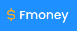
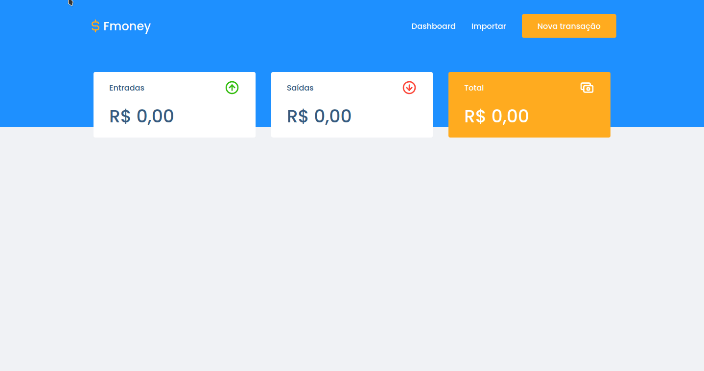
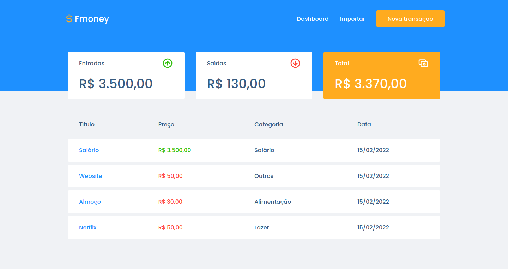
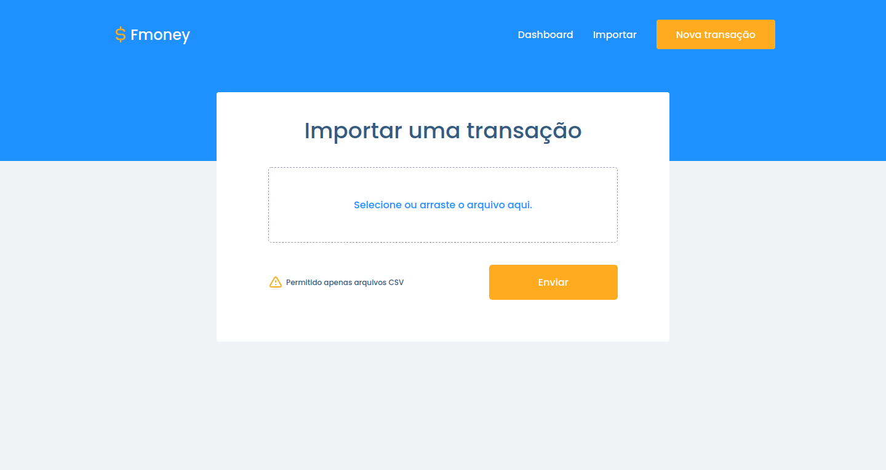
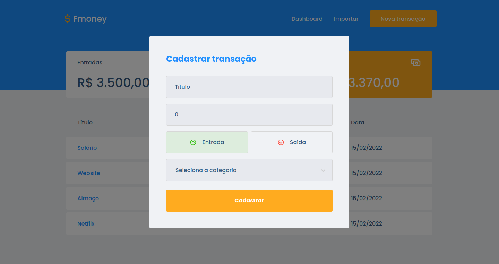

# Financas

<p align="center">
  
</p>

<h2 align="center">
  A simple finance tracker app. Built with ReactJS, Styled Components and Typescript.
</h2>

<p align="center">
  

  

  <a href="https://github.com/areasflavio/financas/commits/master">
    
  </a>
</p>

<p align="center">
  <a href="#star-features">Features</a>&nbsp;&nbsp;|&nbsp;&nbsp;
  <a href="#keyboard-technologies">Technologies</a>&nbsp;&nbsp;|&nbsp;&nbsp;
  <a href="#computer_mouse-installation">Installation</a>
</p>






<br/>

# :star: Features

[(Back to top)](#Financas)

This is a simple finance tracker app. You can start tracking your finances right away.

Some key features are:

- Functional application with ReactJS.
- UI built with Styled Components.
- Cards that resume the income, outcome and the final balance.
- Table that displays all transactions.
- Intuitive new transaction form.
- Upload CVS files.

The application is built using ReactJS. Data is provided by a proprietary API,
in this [repository](https://github.com/areasflavio/financas-server). The user
interface is built with Styled Components. The entire codebase is written using
Typescript.

<!--
<p align="center">
  Checkout the <a href="https://areasflavio-financas.herokuapp.com">API Live version</a>
   hosted on:
</p>
<p align="center">
    
</p>

<p align="center">
  You also can check the complete <a href="https://tasked.vercel.app">Application Live version</a>
  hosted on:
</p>
<p align="center">
    
</p>
-->

<br/>

# :keyboard: Technologies

[(Back to top)](#Financas)

This is what I used and learned with this project:

- [x] ReactJS
- [x] Styled Components
- [x] React Router Dom
- [x] React Modal
- [x] React Dropzone
- [x] React Select
- [x] Axios
- [x] Filesize
- [x] Polished
- [x] Axios
- [x] Eslint
- [x] Prettier
- [x] Typescript

<br/>

# :computer_mouse: Installation

[(Back to top)](#Financas)

To use this project, first you need NodeJS and the API running in your device,
then you can follow the commands below:

```bash
# Clone this repository
git clone https://github.com/areasflavio/financas.git

# Go into the repository
cd financas

# Install dependencies for the application
yarn install

# Copy the .env.example to the .env file and inject your credentials
cp .env.example .env

# To start the development server, run the following command
yarn start
```

# :man_technologist: Author

[(Back to top)](#Financas)

Build by Flávio Arêas 👋 [Get in touch!](https://www.linkedin.com/in/areasflavio/)
